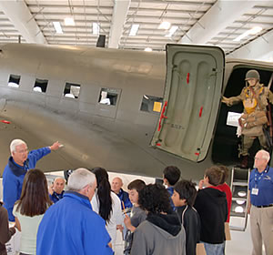

# Lyon Air Museum

Lyon Air Museum is one of the cleanest local answers if you want a destination-feel activity built around real machines rather than small display cases. The museum sits beside John Wayne Airport and fills a hangar with historic aircraft, vehicles, and war-era artifacts.

## Why It Stands Out

The scale is the hook here. This is not a tiny aviation corner inside a broader museum. You are walking among full aircraft, including a DC-3, a B-17, and other major pieces that make the outing feel bigger and more cinematic than a standard history stop.

## Practical Notes

- The museum says it is open daily from 10:00 a.m. to 4:00 p.m.
- Current published admission is `$15` general, `$9` for ages 5-17, and free for children under 5.
- The working-airport adjacency adds extra value because the whole outing keeps an aviation atmosphere even before you enter.
- Group tours and some closures require checking the current notices page before going.

## Links

- Website: https://lyonairmuseum.org/visit-us/
- Booking: https://lyonairmuseum.org/visit-us/
- Maps: https://www.google.com/maps/search/?api=1&query=19300+Ike+Jones+Road+Santa+Ana+CA+92707

## Photo Sources

- https://lyonairmuseum.org/
- https://lyonairmuseum.org/visit-us/
- https://lyonairmuseum.org/exhibits/
