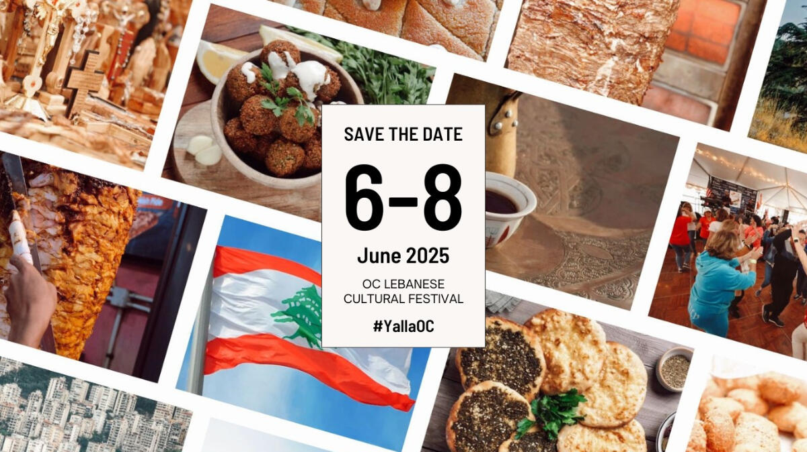

# OC Lebanese Cultural Festival 2026

This is one of the stronger Orange County food-and-culture festival additions because it clearly centers a living community tradition rather than generic event branding. The official site leans hard into hospitality, cuisine, entertainment, and all-day family activity.

## Why It Stands Out

The main value is the density of what you can do in one stop: Lebanese food, dance, music, retail vendors, a kids zone, and a full weekend format. It has the kind of "wander, snack, watch, browse, repeat" flow that makes an event easy to recommend.

## 2026 Timing

- Scheduled for June 5-7, 2026.

## Practical Notes

- The festival is hosted by St. John Maron Maronite Catholic Church in Orange.
- The official site highlights live entertainment, Mediterranean food, beer and wine, a hookah area, retail vendors, and a kids zone.
- Kids age 7 and under are currently listed as free.
- Admission varies by day and time, so check the latest posted pricing before going.

## Links

- Website: https://oclebanesefestival.com/
- Booking: https://oclebanesefestival.com/
- Maps: https://www.google.com/maps/search/?api=1&query=300+S+Flower+St+Orange+CA+92868

## Photo Sources

- https://oclebanesefestival.com/
