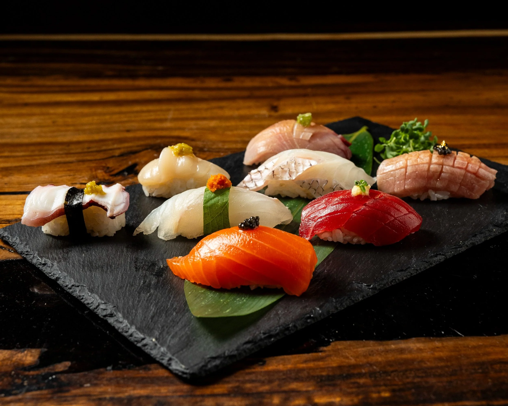
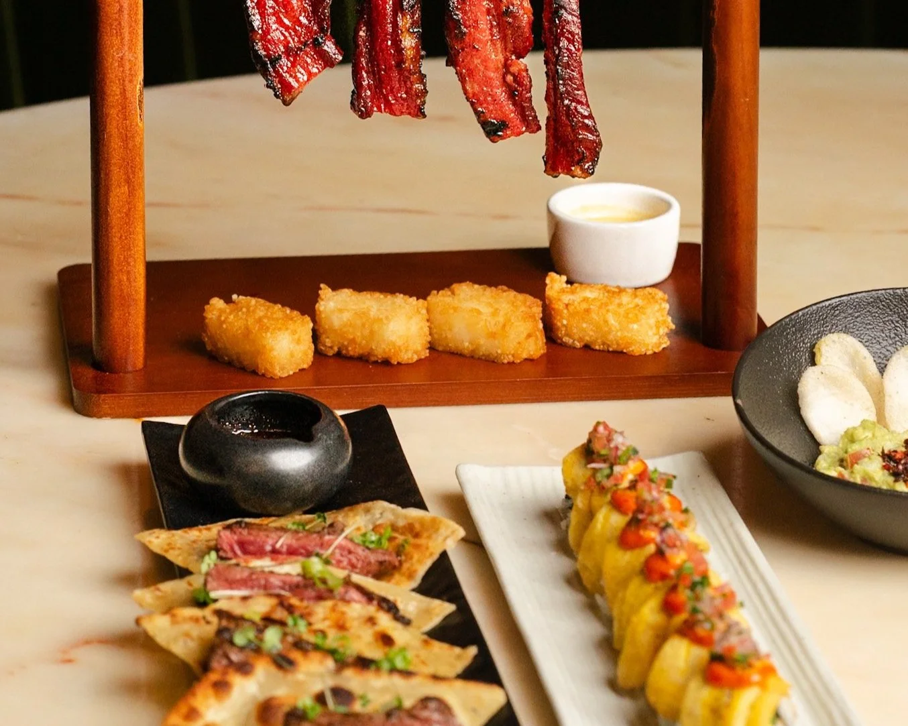
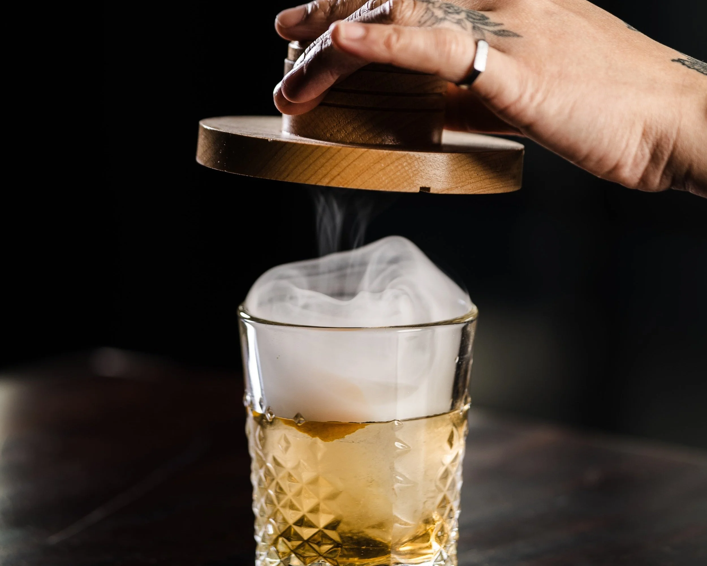

# NOVA Kitchen & Bar

## Photos

Photo sources:
- https://images.squarespace-cdn.com/content/v1/5b6dd5223c3a53bec99a310d/d08053d1-71eb-48a4-917c-cf9545e6c7c4/Nova_99.jpg
- https://images.squarespace-cdn.com/content/v1/5b6dd5223c3a53bec99a310d/0013f005-a52b-4a59-9057-1b1c2f00ac2c/DSC00415.jpg
- https://images.squarespace-cdn.com/content/v1/5b6dd5223c3a53bec99a310d/a60c8faf-a5b6-4a82-9379-d9b6969fe191/NOVA-JAN25-COCKTAIL-26.jpg

Photo note:
- The official site exposes a good mix of room, food, and cocktail photography, so I used that spread instead of repeating only bar shots.

## Description

NOVA positions itself as a five-element dining experience, with pan-Asian food, multiple themed dining zones, and a more theatrical framing than a standard fusion restaurant in Garden Grove.

## What Makes It Unique

The core hook is structural, not decorative. The venue explicitly organizes the experience around wood, fire, earth, metal, and water, then extends that concept into the room design, menu structure, omakase nights, and special-event programming.

## Notes

- Reservations: Regular reservations are available online; the venue recommends reservations for parties of 6 or more and keeps a 15-minute grace period.
- Dress code: Not clearly stated on the official site.
- Age policy: The official site promotes family-oriented brunch programming and does not publish a child restriction; I treated this as kid-friendly.
- Other: Tuesday and Wednesday omakase is advertised at $68 per person, which makes this one of the easier OC entries to book as a themed-feeling special occasion without full tasting-menu pricing.
