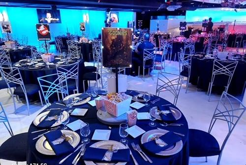
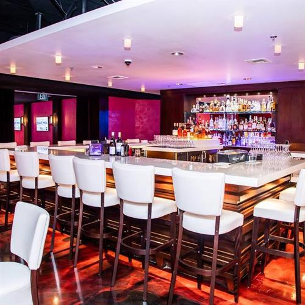
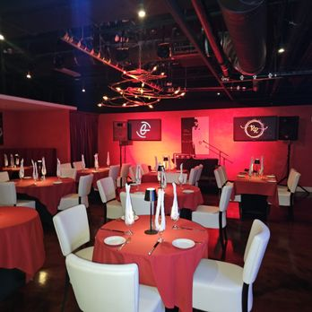

# Red Room Speakeasy Supper Lounge

## Photos

Photo sources:
- https://chambermaster.blob.core.windows.net/images/customers/2866/members/9759/photos/GALLERY_MAIN/celebrations_venue_pic.jpg
- https://chambermaster.blob.core.windows.net/images/customers/2866/members/9759/photos/GALLERY_MAIN/celbrations_red_room_bar.jpg
- https://chambermaster.blob.core.windows.net/images/customers/2866/members/9759/photos/GALLERY_MAIN/celbrations_red_room1.jpg

Photo note:
- The direct official page path I tried returned a 404, so I used venue-specific photos from the Costa Mesa Chamber listing for The Celebrations Venue and Red Room.

## Description

Red Room is a newer Orange County fit for this list because it is clearly trying to be a supper club experience, not only a dinner reservation. The room, music program, and dressier posture are part of the pitch.

## What Makes It Unique

The strongest hook is atmosphere plus performance. OpenTable describes a speakeasy supper club with red Venetian stucco, cocktails, Italian food, and live jazz or standards, which pushes it past generic "date-night Italian" territory.

## Notes

- Reservations: Bookable on OpenTable, with recurring experience listings tied to live music nights.
- Dress code: OpenTable lists the dress code as dressy.
- Age policy: I did not find a clear official child policy, so this is marked `Mixed / Time-dependent` rather than guessing.
- Other: The current OpenTable listing describes it as Italian, speakeasy, and cocktail bar, with pricing above $50.
