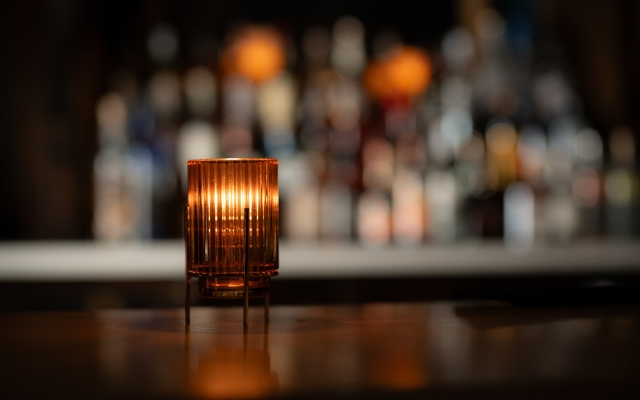
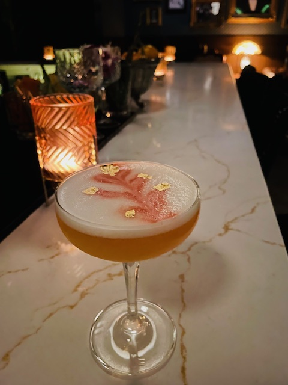
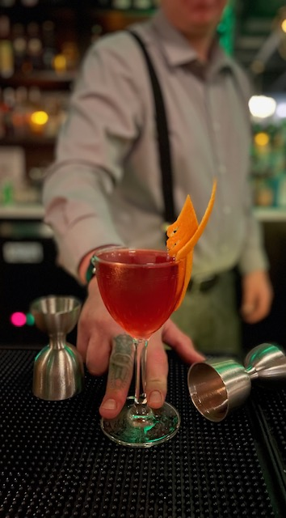

# Roost 374

## Photos

Photo sources:
- https://roost374.com/wp-content/uploads/2024/08/xd6slOs6nRVAVrXvBKRvkavic.jpg
- https://roost374.com/wp-content/uploads/2024/09/IMG_7147.jpg
- https://roost374.com/wp-content/uploads/2024/09/IMG_6657.jpg

Photo note:
- Roost's official gallery exposes image files but not strong descriptive captions, so I kept the alt text conservative rather than over-claiming what each gallery image shows.

## Description

Roost 374 is an intimate San Clemente speakeasy that goes beyond hidden-door marketing. The room is deliberately small, the service format is controlled, and the venue asks guests to buy into the period mood.

## What Makes It Unique

This is one of the better South Orange County additions because the concept has rules. Roost explicitly aims to transport guests to the 1920s and 30s, asks people to put phones away, enforces a dress code, limits capacity, and keeps the room seated-only to protect the atmosphere.

## Notes

- Reservations: No regular reservations; official site says first come, first served, with no standing room.
- Dress code: No shorts outside July through September, no flip flops, and no baseball or trucker-style hats or visors.
- Age policy: The official site requires valid ID for all guests and says private gatherings are 21+ only; this reads as an adult-focused bar, so I marked it `No`.
- Other: Capacity is listed as 38 seats, which is part of why the room feels more controlled and transportive than a larger casual cocktail lounge.
