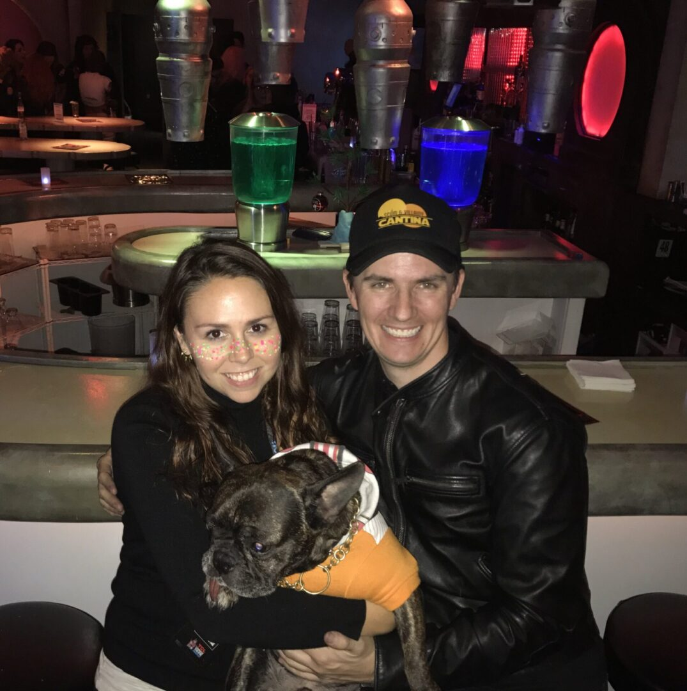

---
title: Scum & Villainy Cantina
tags:
  - restaurant
  - immersive
area: Hollywood / Los Angeles
venueType: Themed cantina bar
website: https://scumandvillainycantina.com/
googleMaps: >-
  https://www.google.com/maps/search/?api=1&query=Scum+and+Villainy+Cantina+Hollywood
openTable: https://www.opentable.com/s?term=Scum%20and%20Villainy%20Cantina
price: '$$'
kidsAllowed: 'Mixed / Time-dependent'
description: >-
  Scum & Villainy is a Hollywood sci-fi cantina that commits to its fandom world from the second you walk in.
standout: >-
  It is immersive in the purest themed-bar sense: low-light space, costumed energy, no attempt to feel normal, and a room that pushes you into roleplay more than observation.
---

# Scum & Villainy Cantina

## Photos

Photo sources:
- https://scumandvillainycantina.com/wp-content/uploads/2021/04/J-scaled.jpg

Photo note:
- Removed logo assets and kept only the interior image that shows the cantina atmosphere.

## Description

Scum & Villainy is a Hollywood sci-fi cantina that commits to its fandom world from the second you walk in.

## What Makes It Unique

It is immersive in the purest themed-bar sense: low-light space, costumed energy, no attempt to feel normal, and a room that pushes you into roleplay more than observation.

## Notes

- Reservations: The venue advertises first come, first served.
- Dress code: Casual, costumes welcome when event rules allow.
- Age policy: Official site states all ages until 8 p.m.
- Other: Better for drinks and atmosphere than food-led dining.

