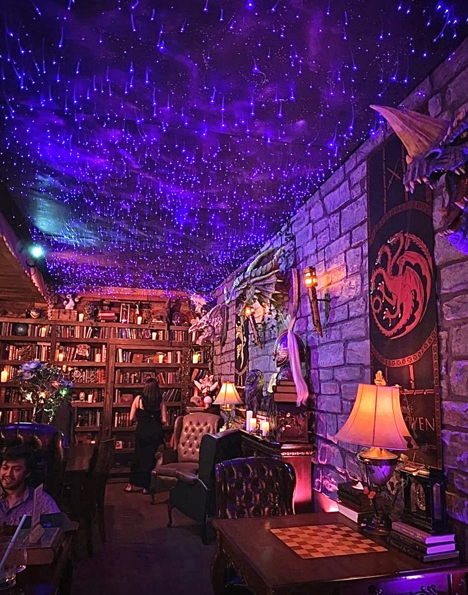
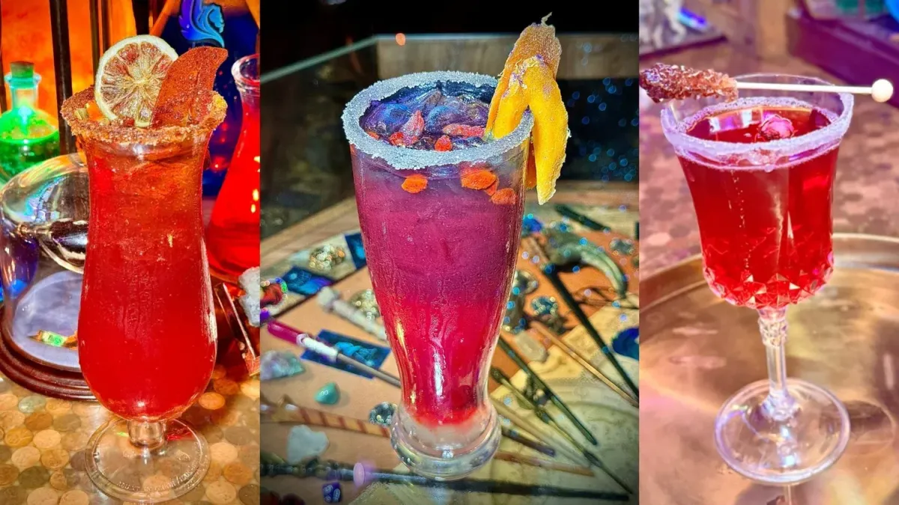

# Elixir Wizard Academy & Boba Tea Bar

## Photos

Photo sources:
- https://images.leadconnectorhq.com/image/f_webp/q_80/r_1200/u_https://assets.cdn.filesafe.space/UQSdFejO14eTsw0wtAGk/media/6999458608245e73342867c9.jpg
- https://images.leadconnectorhq.com/image/f_webp/q_80/r_1200/u_https://storage.googleapis.com/msgsndr/UQSdFejO14eTsw0wtAGk/media/69963f1c905d47a535c35512.webp

Photo note:
- Removed the branding/logo image and kept only a venue interior shot plus themed drinks.

## Description

Elixir is a fantasy tea-and-boba concept that leans into wizard-school energy, playful quest vibes, and themed decor rather than standard cafe minimalism.

## What Makes It Unique

For Orange County, this is one of the most all-in whimsical concepts. The appeal is not culinary ambition so much as full commitment to a world and mood.

## Notes

- Reservations: Usually not essential for a casual stop.
- Dress code: Casual.
- Age policy: Good all-ages pick.
- Other: Best used as a dessert or drinks stop inside a larger date-night plan.
