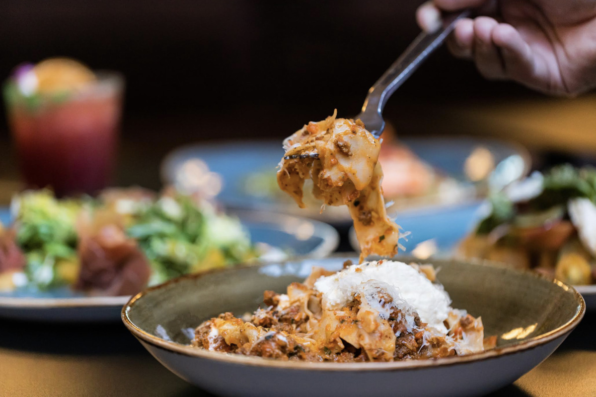

# insideOUT

## Photos

Photo sources:
- https://static.spotapps.co/web/insideoutsd--com/custom/about_us_back.jpg
- https://static.spotapps.co/web/insideoutsd--com/custom/about_us_right_3.jpg

Photo note:
- Removed the generic website hero/background image and kept only official-site images that appear to show the actual dining space.

## Description

insideOUT is a polished San Diego restaurant-lounge that periodically retools itself with seasonal installations and visually heavy decor moments.

## What Makes It Unique

It is less lore-driven than Realm or Strong Water, but its seasonal overlays and strong design make it one of the better "immersive-ish" dining environments in San Diego.

## Notes

- Reservations: Recommended for peak evenings.
- Dress code: Stylish casual.
- Age policy: Treat as mixed and confirm for the specific service or event.
- Other: Best when a seasonal theme is running.
