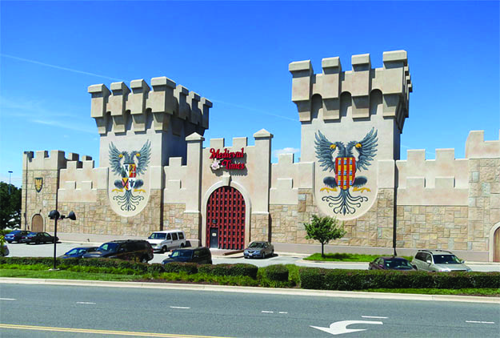
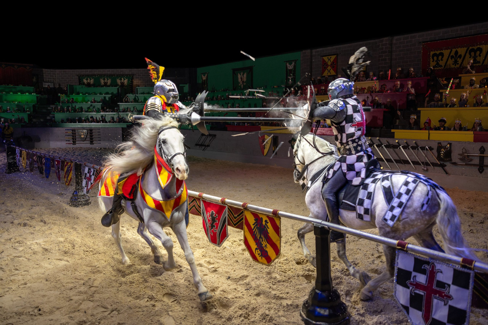

# Medieval Times Buena Park

## Photos

Photo sources:
- https://medt-refresh.imgix.net/wp-content/uploads/2020/03/29014350/castle-ca.jpg
- https://medt-refresh.imgix.net/wp-content/uploads/2023/12/25000756/250204_Shot06_Jousting_0093_Web-Compressed-scaled.jpg

Photo note:
- Removed the badge graphic and kept only venue atmosphere and performance imagery.

## Description

Medieval Times is still one of Southern California's strongest large-format dinner experiences: castle staging, cheering sections, horses, swordplay, and a built-in event rhythm.

## What Makes It Unique

Few places commit to a total environment on this scale. It is not subtle, but that is the point.

## Notes

- Reservations: Book tickets in advance.
- Dress code: Casual.
- Age policy: Family-friendly.
- Other: More show-first than food-first, but the spectacle is exactly why it belongs here.
